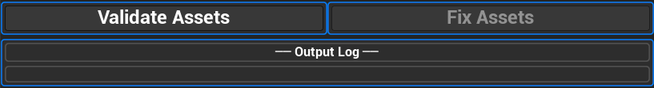
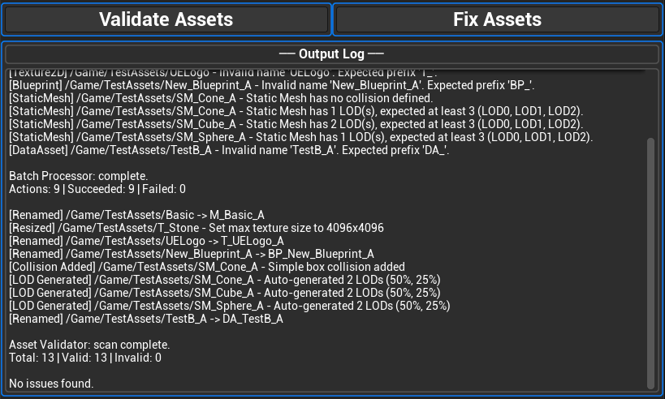
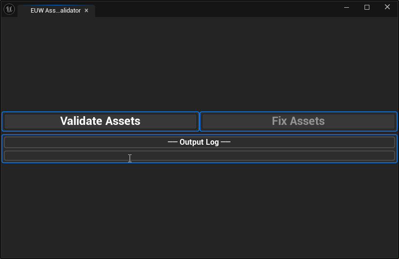

# Asset Tools Validator

Lightweight asset validation and batch processing tool built using Unreal Engine Editor Utility Widgets and Python.

Enforces naming conventions and detects common pipeline issues directly inside the editor, then automatically fixes them in one click.

## Preview

Animated demo (GIF)

## Features
- **Naming Convention Validation** — Detects missing asset prefixes (`SM_`, `T_`, `M_`, `DA_`, `BP_`, `MI_`) and invalid numeric suffixes
- **DataAsset Subclass Detection** — Correctly identifies Blueprint-based DataAsset subclasses in the asset registry
- **Texture Dimension Validation** — Checks that textures do not exceed 4096x4096 resolution
- **Collision Validation** — Ensures Static Meshes have simple collision data defined
- **LOD Validation** — Ensures Static Meshes have at least 3 LODs (LOD0, LOD1, LOD2)
- **Batch Asset Processor** — Automatically fixes all detected issues:
  - Renames assets to match naming conventions
  - Caps oversized textures to 4096x4096
  - Adds simple box collision from bounding box
  - Auto-generates LODs with progressive triangle reduction (50%, 25%)
- **Scrollable Log Output** — Results append to a scrollable log window that auto-scrolls to the latest output

## Architecture
- **UI Layer:** Editor Utility Widget (Blueprint)
- **Validation Layer:** Python — `asset_validator.py` (Unreal Python API)
- **Processing Layer:** Python — `batch_processor.py` (Unreal Python API)
- **Flow:** Validate button → scan & report issues → Fix Assets button → batch fix all issues

## Setup

1. Open the project in Unreal Engine 5.7
2. Ensure the Python plugin is enabled
3. Open the Editor Utility Widget to validate and fix assets

## Tech
- Unreal Engine 5.7
- Python (Unreal Python API)
- Blueprint (Editor Utility Widget)
