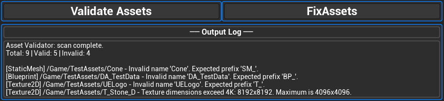

# Asset Validator Tool (Unreal Engine + Python)

**Status: Work in Progress**

## Overview
Lightweight asset validation tool built using Unreal Engine Editor Utility Widgets and Python.

Designed to enforce naming conventions and detect common pipeline issues directly inside the editor.

---

## Features (Current)
- **Naming Convention Validation** — Detects missing asset prefixes (`SM_`, `T_`, `M_`, `DA_`, `BP_`, `MI_`)
- **Texture Dimension Validation** — Checks that textures do not exceed 4096x4096 resolution
- **Asset Registry Scanning** — Fast, non-destructive scanning using Unreal's AssetRegistry API
- **One-click Validation** — Integrated Editor Utility Widget for easy access

---

## Preview

---

## Architecture
- **UI Layer:** Editor Utility Widget (Blueprint)
- **Logic Layer:** Python (Unreal Python API)
- **Flow:** Button click → Python validation → Results display in UI widget

---

## Tech Stack
- Unreal Engine (Editor Utility Widgets)
- Python (Unreal Python API)

---

## Purpose
Demonstrates pipeline tooling and asset validation practices used in production environments.